# Photos needing identification

These photos are not in the service candidate folders. Confirm the equipment or circuit before assigning a service.

## 001 — IMG_0026.HEIC

What is the appliance model, and does it supply domestic hot water, space heating or both?

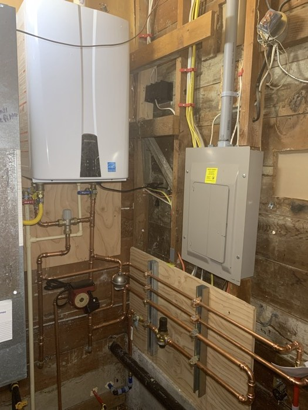

## 002 — IMG_0028.HEIC

What is the appliance model, and does it supply domestic hot water, space heating or both?

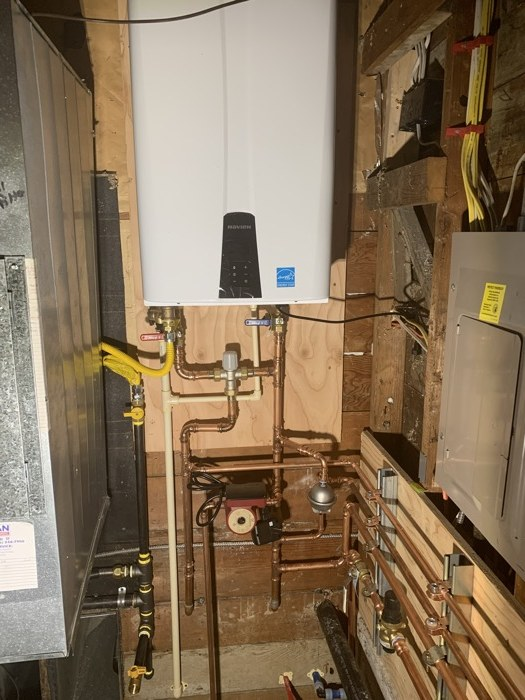

## 073 — IMG_3265.HEIC

What are the appliance models, and do they supply domestic hot water or space heating?

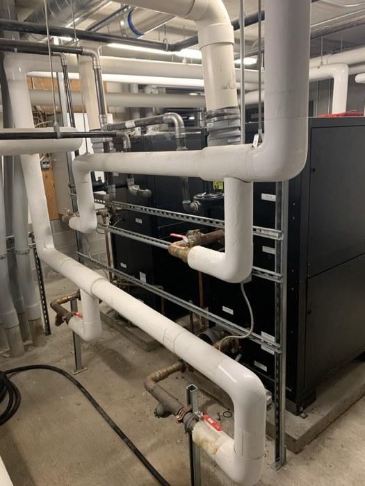

## 074 — IMG_3266.HEIC

Confirm the appliance model and whether this is a domestic hot-water plant or a boiler plant.

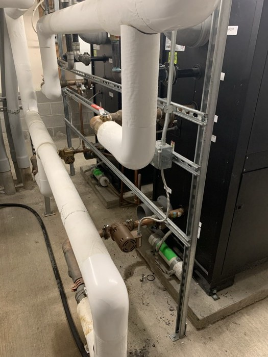

## 075 — IMG_3267.HEIC

Does the equipment serve domestic hot water or hydronic heating?

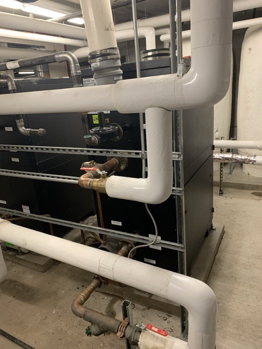

## 076 — IMG_3268.HEIC

Confirm the appliance models and service before assigning boilers or tankless water heaters.

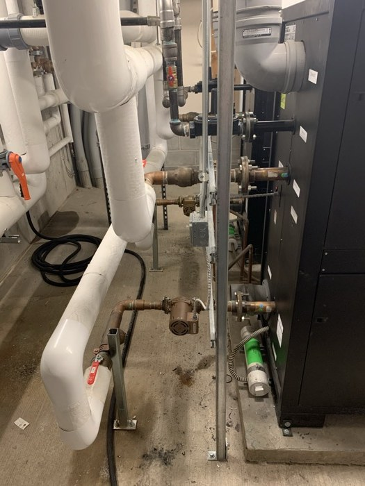

## 077 — IMG_3269.HEIC

Is this plant for domestic hot water or hydronic space heating?

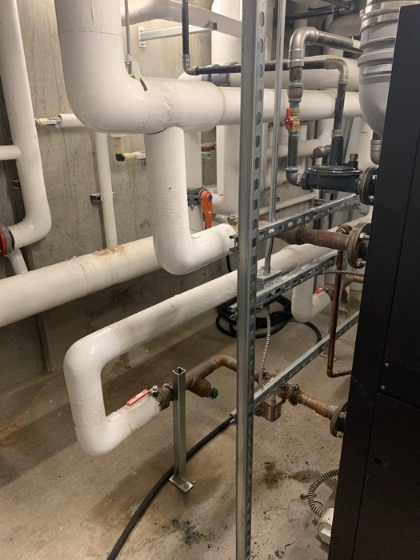

## 081 — IMG_3366.JPG

Confirm the Navien models before using the tankless-water-heater category.

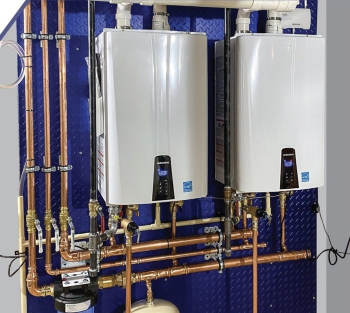

## 093 — IMG_3640.HEIC

Confirm the Rheem model before assigning the tankless-water-heater subtype.

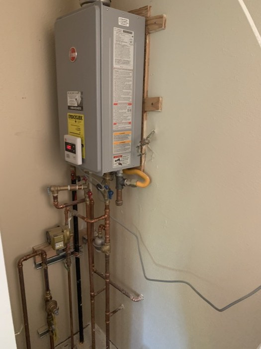

## 094 — IMG_3641.HEIC

Confirm the model to distinguish a tankless domestic water heater from another wall appliance.

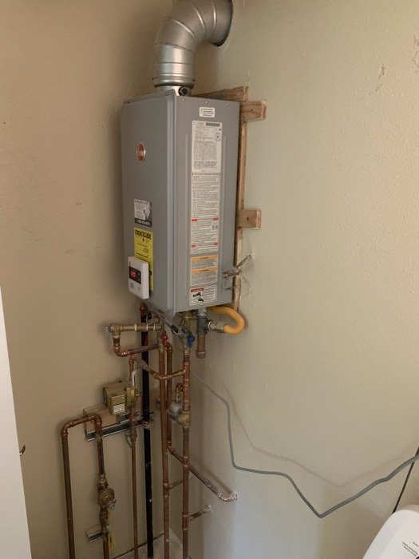

## 096 — IMG_3652 3.HEIC

Is this bore for a water line, sewer line or another utility?

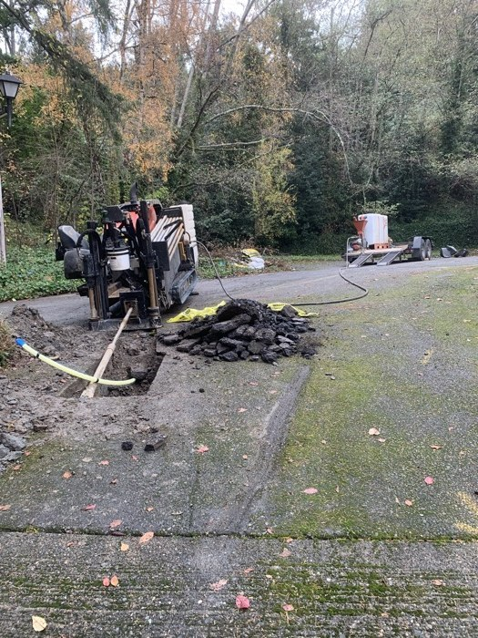

## 137 — IMG_7276.JPG

Do these vessels and pumps serve domestic water, hot-water storage, space heating or another process?

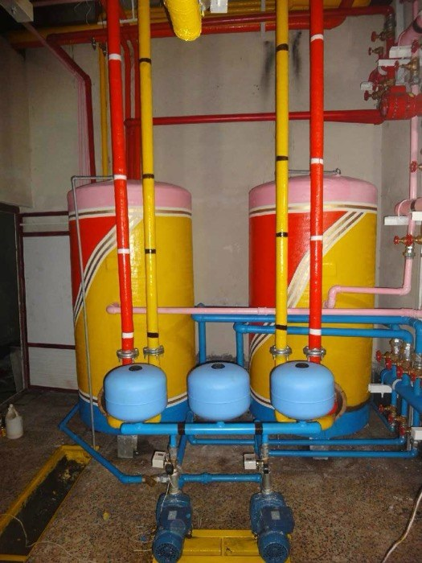

## 138 — IMG_7277 2.JPG

What does this vessel and circulation circuit serve?

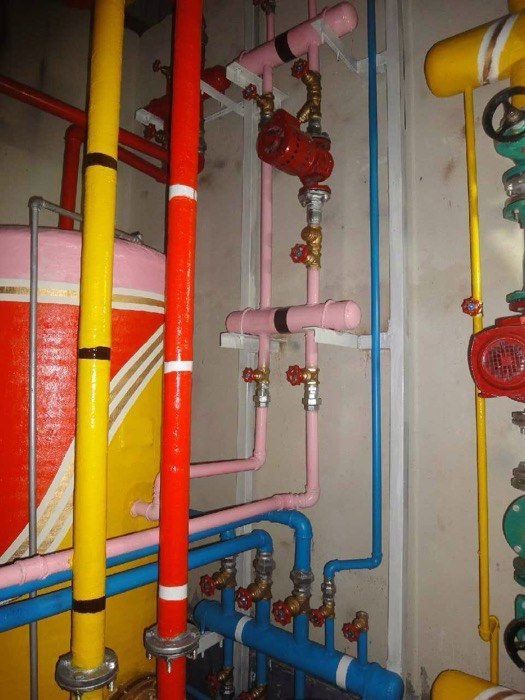

## 139 — IMG_7278.JPG

Which system and fluid do these headers serve?

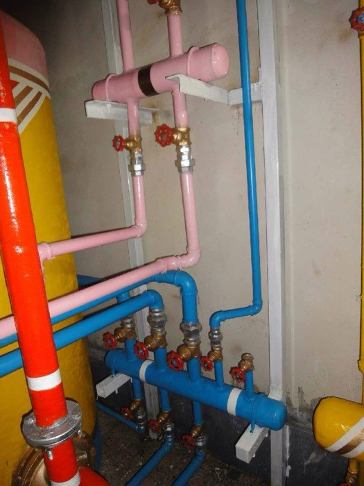

## 148 — IMG_7289.JPG

What system does this corroded pipe belong to?

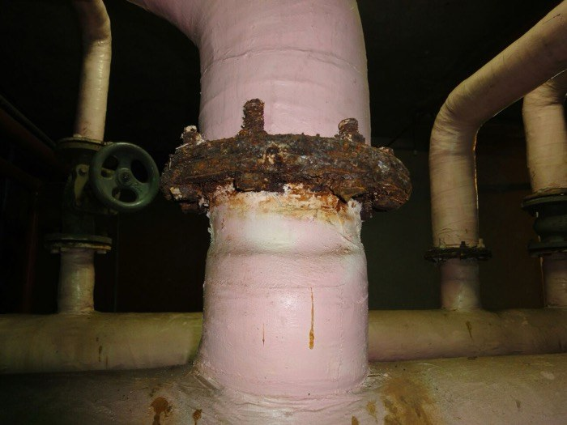

## 150 — IMG_7291.JPG

Does this circuit serve domestic hot water, space heating or another process?

## 151 — IMG_7292.JPG

What are the cylindrical components, and which system does this manifold serve?

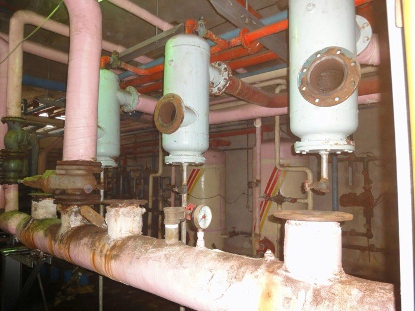

## 153 — IMG_7294.JPG

What are these components, and do they belong to heating, domestic water or another process?

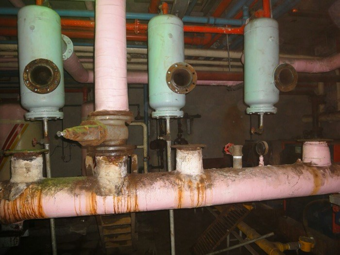

## 154 — IMG_7295.JPG

Which system and fluid does this valve serve?

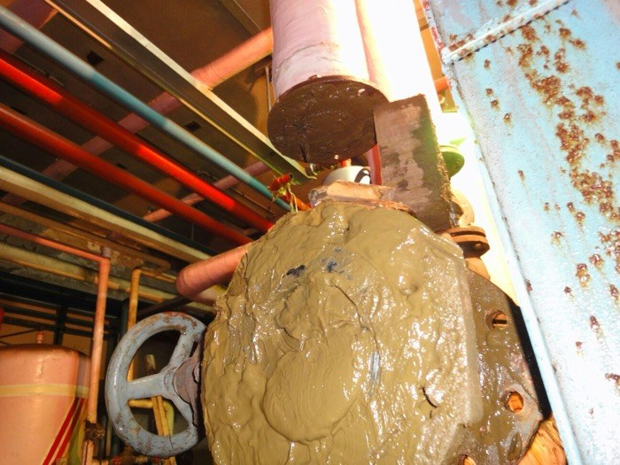

## 155 — IMG_7296.JPG

What process or building service does this manifold supply?

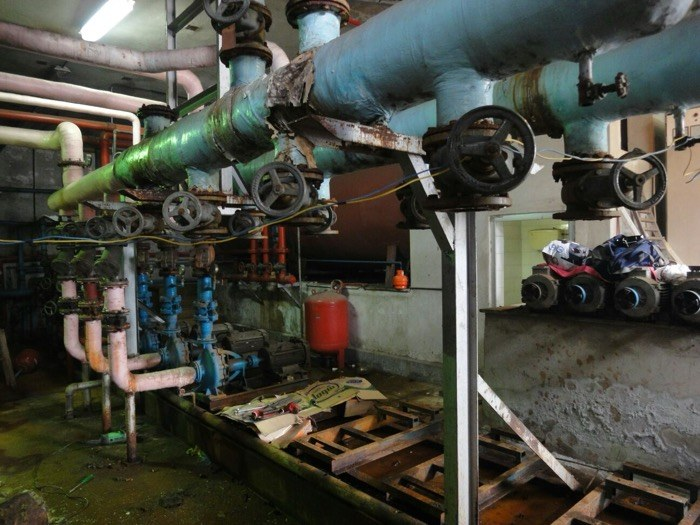

## 158 — IMG_7300.JPG

What is the vessel's model and function: domestic hot-water storage, heating buffer, pressure storage or another use?

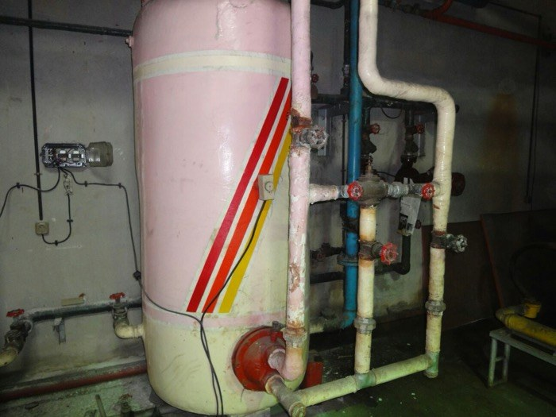

## 160 — IMG_7302.JPG

What fluid and system do these pumps circulate?

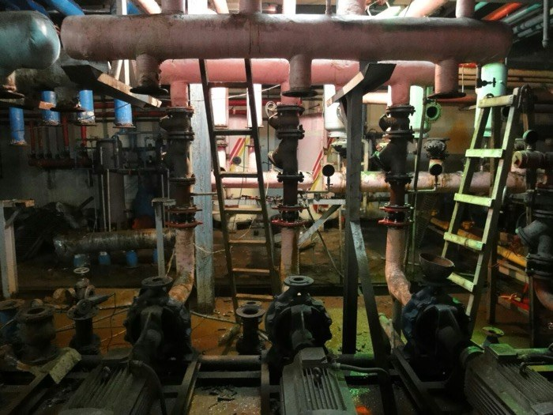

## 162 — IMG_7304.JPG

Which system do these valves and pipes serve?

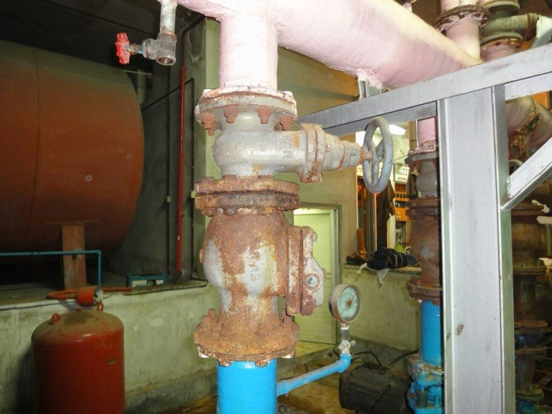

## 163 — IMG_7310.JPG

What service does this valve control?

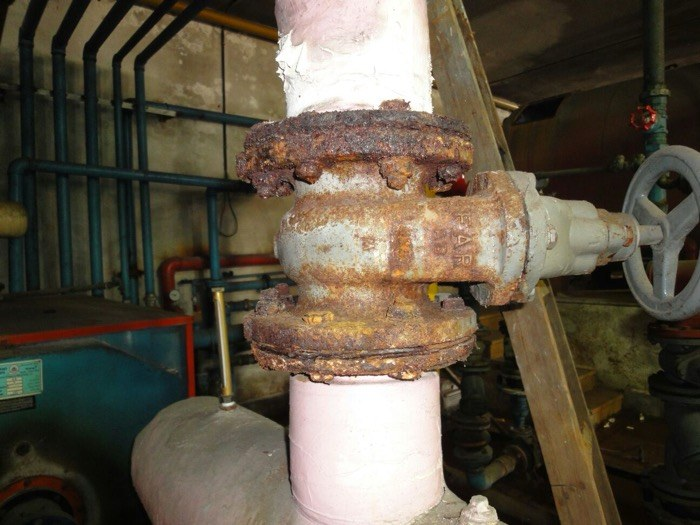
